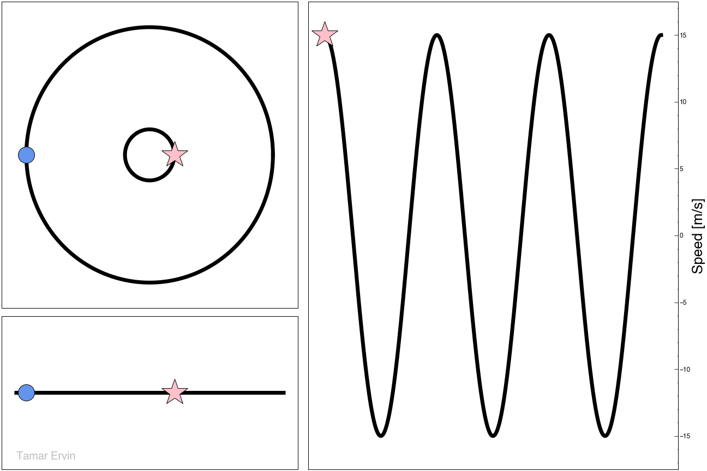
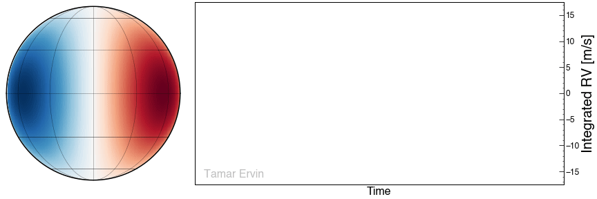

# SolAster

Welcome to the documentation site for the SolAster package. SolAster independently
calculates 'Sun-as-a-star' radial velocity variations using data from the Helioseismic 
and Magnetic Imager (HMI).  

Additional information can be found by navigating through the links on the left. 

For the source code check out our [GitHub](https://github.com/tamarervin/SolAster)!

# Radial Velocity Method

The radial velocity (RV) technique searches for periodic 
Doppler shifts in stellar spectra induced by the presence of
a planetary companion. To detect Earth-like planets orbiting 
Sun-like stars, improvements in RV measurement precision are 
required to push beyond the current 1 m/s measurement floor 
down to the 10 cm/s level. Stellar activity signals can mask 
or even masquerade as planetary signals and must be modeled 
and removed to reach the sensitivity required to detect 
Earth-like planets.

  

## Methodology

Using a combination of data products from the Helioseismic 
and Magnetic Imager (HMI) aboard the Solar Dynamics Observatory
(SDO), we develop a data analysis pipeline that is aimed at complimenting 
future extreme-precision RV (EPRV) studies of the Sun. 
The pipeline uses SDO/HMI data products to better characterize
a suite of solar magnetic activity parameters, and performs 
a simple decorrelation analysis on disk-integrated RV 
measurements. Using high resolution data, we automatically 
calculate “Sun-as-a-star” RV variations as a combination of 
individual velocity components that serve as a strong proxy 
for surface magnetic activity, providing a independent window
into the stellar surface that can aid in interpreting ground-based 
RV measurements.

There are two primary activity effects that strongly impact 
the measured RV: the velocity variation due to the traversing 
motion of sunspots and faculae across the rotating solar 
surface (photometric effect), and the variation due to the 
suppression of the convective blueshift by active regions 
(convective effect) . Building upon methods from Haywood et al. 
(2016) and Milbourne et al. (2019), we independently calculate
these velocity components for comparison with solar observables
and ground-based measurements.  

## Application to planetary transits

We apply these methods to recover the corresponding Rossiter–McLaughlin (RM) 
signals due to the transits imaged by SDO. We apply our pipeline methods to these 
time frames in the attempt to recover the effect of the planetary transits
and empirically estimate the precision floor of our constructed ‘Sun-as-a-star’ RVs. 

 